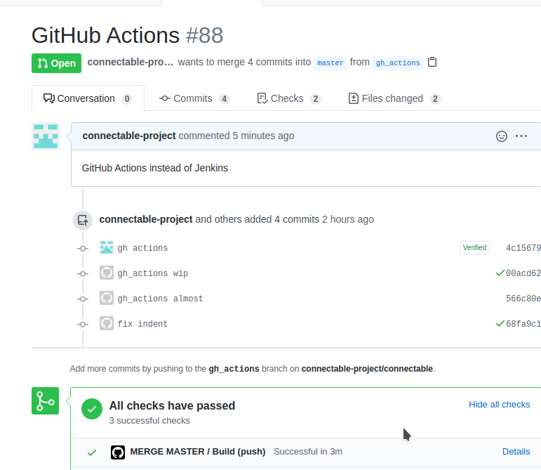
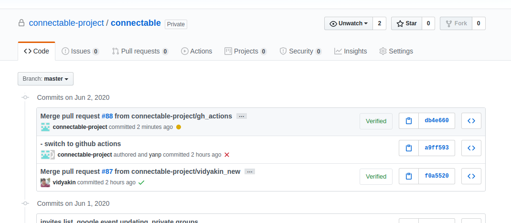

# Connectable

Docker-based version 2.0


This repo contains:

* ***docker-compose.yaml*** - docker-compose configuration for Local Development
  * ***.env.dev*** - env file for Local Development
* ***docker-compose-prod.yaml*** - docker-compose configuration for Production\
  * ***.env.prod*** - env file for Production. It should NOT contain secrets and should alwas be updated if .env.dev is updated, otherwise, env changes will not get deployed to Production

Both files have the same set of services:

- **connfrontend** - Frontend (Vue.js) service
- **connbackend** - Bakcend (Node.js) service
- **mongodb** - MongoDB service

## Local Dev Env with docker-compose.

#### 1. To start Connectable locally, run:

```
$ docker-compose up
```
Or, start without logs to stdout in quiet mode:
```
$ docker-compose up -d
```
Connectable Local Dev URL is: ***http://localhost:8080***


#### 2. Make code changes
You can change the code for Frontend or Backend in real time and the updates will get inside containers on your local PC.


#### 3. Stop or RE-create containers

You can temporary stop and start ***running*** docker-compose services

```
$ docker-compose up start
$ docker-compose up stop
```

If necessary, re-build and re-deploy separate containers locally:
```
$ docker-compose build connbackend
$ docker-compose up --no-deps -d connfrontend
```
To completely destroy containers, images, volumes:
```
$ docker-compose down --rmi all -v
```

To check logs of a running service:
```
# (search for container NAME)
$ docker ps
$ docker logs <container_name>
```

## CI/CD with GitHub Actions

#### 1.Each Pull Request to  ***Master*** branch is checked by this job: https://github.com/connectable-project/connectable/blob/master/.github/workflows/pr-master.yml
GitHub Actions checks that:  
* it is possible to build Frontend with NPM
* it is possible to build Backend with NPM
* it is possible to build Frontend and Backend containers with Docker
* More to be done (tests, other checks...)

Pull Requests will have Green/Red status on PullRequest page:



#### 2.Each merge to ***Master*** branch triggers ***DEPLOY TO PRODUCTION***.
GitHub Actions will run this Job: https://github.com/connectable-project/connectable/blob/master/.github/workflows/merge-master.yml

The job is doing the following:
- pull master changes to local server (prod)
- re-build docker containers for Front and Back (mongo remains the same)  
You can see the job status in the commit tree after merge:




***If the status of any Job is RED - go to Actions > Open red build > click on 'build' and inspect the logs to understand the problem***

## How to download backups from Google Bucket
Google Cloud Bucket contains ZIP archive with DB backup and Git repository backup:
- open 'connectable-prod' project
- go to Storage > Browser
- open 'connectable-backups' bucket
- click on the archive name, example: '2020_06_06_00_00.zip'
- click 'Download' button on the top
