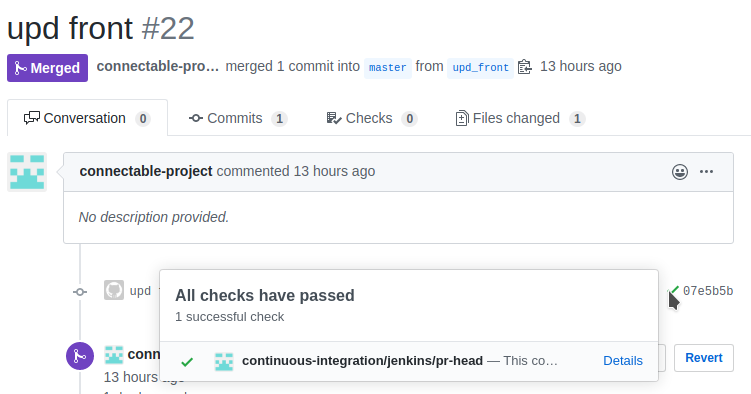
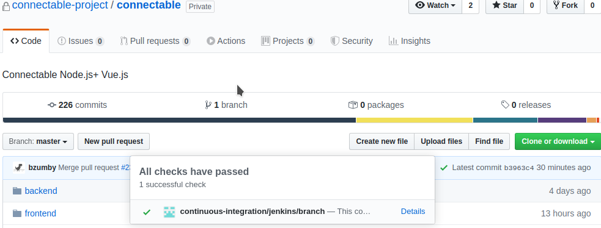
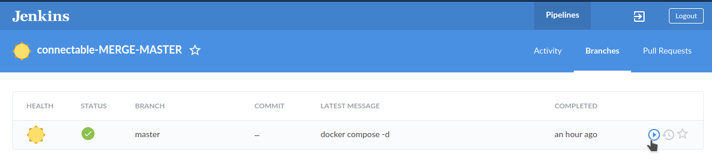

# Connectable

Docker-based version 2.0


This repo contains:

* ***docker-compose.yaml*** - docker-compose configuration for Local Development
  * ***.env.dev*** - env file for Local Development
* ***docker-compose-prod.yaml*** - docker-compose configuration for Production\
  * ***.env.prod*** - env file for Production. It should NOT contain secrets and should alwas be updated if .env.dev is updated, otherwise, env changes will not get deployed to Production

Both files have the same set of services:

- **connfrontend** - Frontend (Vue.js) service
- **connbackend** - Bakcend (Node.js) service
- **mongodb** - MongoDB service

## Local Dev Env with docker-compose.

#### 1. To start Connectable locally, run:

```
$ docker-compose up
```
Or, start without logs to stdout in quiet mode:
```
$ docker-compose up -d
```
Connectable Local Dev URL is: ***http://localhost:8080***


#### 2. Make code changes
You can change the code for Frontend or Backend in real time and the updates will get inside containers on your local PC.


#### 3. Stop or RE-create containers

You can temporary stop and start ***running*** docker-compose services

```
$ docker-compose up start
$ docker-compose up stop
```

If necessary, re-build and re-deploy separate containers locally:
```
$ docker-compose build connbackend
$ docker-compose up --no-deps -d connfrontend
```
To completely destroy containers, images, volumes:
```
$ docker-compose down --rmi all -v
```

To check logs of a running service:
```
# (search for container NAME)
$ docker ps
$ docker logs <container_name>
```

## CI/CD with GitHub & Jenkins

Jenkins server is available at: http://35.225.90.137:8080  

#### 1.Each Pull Request to  ***Master*** branch is checked by this job: http://35.225.90.137:8080/blue/organizations/jenkins/connectable/pr
Jenkins checks that:  
* it is possible to build Frontend with NPM
* it is possible to build Backend with NPM
* it is possible to build Frontend and Backend containers with Docker
* More to be done (tests, other checks...)

Pull Requests will have Green/Red status from Jenkins in GitHub on PullRequest page:



#### 2.Each merge to ***Master*** branch triggers ***DEPLOY TO PRODUCTION***.
Jenkins will run this Job: http://35.225.90.137:8080/blue/organizations/jenkins/connectable-MERGE-MASTER/branches

The job is doing the following:
- pull master changes to local server (prod)
- re-build docker containers for Front and Back (mongo remains the same)
You can see the job status on the main page after merge:




***If the status of any Job is RED - click on 'Details' and inspect the logs of the Jenkins Job to understand the problem***


#### 3.How to start Job manually
If you need to manually deploy prod, or you want to restart any job:
* login to Jenkins here: http://35.225.90.137:8080/
* user = conndev, pass = (ask Jenkins admin)
* Open 'Jobs' page http://35.225.90.137:8080/blue/organizations/jenkins/pipelines
* Choose a job you want to start/re-start


For example, to manually re-deploy prod:
- login to Jenkins
- go to the Job Page http://35.225.90.137:8080/blue/organizations/jenkins/connectable-MERGE-MASTER/branches
- click on 'Run' button
- the latest updates will be uploaded and deployed to prod



